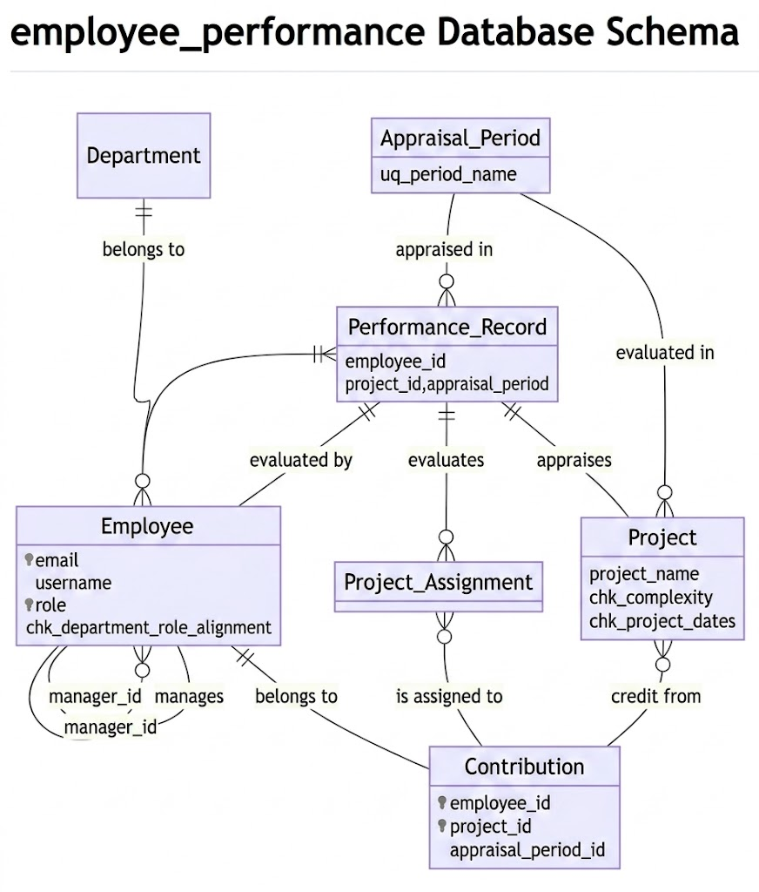

# Design Document

By Aber Abou-Rahma

Video overview: <URL HERE>

## Scope

Purpose:
The purpose of this database is to provide objective guidance to employees' periodic performance appraisal process to both management and HR personnel. Traditionally the periodic employee performance evaluation was determined according to the management input and probably employees' peer reviews input from their colleagues and team mates. 

### In Scope
Implementing this database project accounts for only one important objective criteria which is employees' contribution(s) to the success projects' they were assigned to work on during the target appraisal period.
As indicated earlier there are several factors contributing to the employees periodic performance appraisal. The initial release of the employee performance appraisal database scope explores only employees contributions to the projects they were working on as one of the most important objective measures for the employees performance as indicator to the employees' commitment and discipline.

### Out of Scope
1. Future releases of the employee performance appraisal database shall account for additional important factors contributing to the evaluation of the employees performance such as the reviews notes of their management and selected individual team members to determine in-part the employees effective work relationship or their consistent attendance and compliance with their work schedule, and availability.
2. Future design may include Recommendations for employees' performance and successful contribution.
3. Future design may account for translating the employees' performance appraisal conclusions and results such as, incentives, disincentive, Disciplinary Action / Corrective Actions, possible employees promotions, demotions, or terminations.

## Functional Requirements

### High Level Functional Requirements
Following are the minimal functionality offered by the employee_performance database:
1. The employee_performance database shall define 3 users roles: 'Employee', 'Manager', and 'HR'.
2. Employees shall be able to securely query their own itemized performance log for any specific appraisal period.
3. Employees shall be able to view their assigned projects, localized difficulty baselines, and individual project scores.
4. Employees shall be able to insert and update their own self-appraisal notes for an active cycle.
5. Managers shall be able to view consolidated performance summaries for all employees under their management.
6. Managers shall be able to analyze team project allocations, checking historical delivery trends (Completed_OnSchedule vs. Completed_Overdue) to balance future assignments.
7. Managers shall be able to monitor normalized (percentage) velocity / KPI of their direct reports employees' execution_efficiency_pct of their team members to identify high-velocity contributors for future incentives or  mentorship support for staff needing remediation.
8. HR representative shall be able to analyze team project allocations and related project progress and completion statuses (Completed_OnSchedule vs. Completed_Overdue), for all employees in all departments for clear input to the reward/remediation future plans.
9. HR representative shall be able to  monitor normalized (percentage) velocity / KPI of the entire employees' execution_efficiency_pct of the entire employees, except for managers for accurate employees' performance appraisal.
10. Managers shall be able to log and alter official review notes within transactional records during an active appraisal window, otherwise, they shall not be able to insert or alter review notes within 'locked' appraisal period.

### Out of Scope 
1. No users passwords' policy enforcement.
2. There is no projects' granular task-level tracking. The employee_performance database tracks high-level projects completions per performance evaluation cycle.
3. While the employee_performance database outputs a reliable performance index (execution_efficiency_pct), it does not calculate monetary bonuses, process promotions, nor suggests the distribution of payrolls.
4. The database is scoped to provide relational tabular data without any interactive dashboards serving visual charts, nor providing any visual effects/formats to view the data.

## Representation

### Entities

#### departments Table
id: The ID of the department.
department_name: The name of the department.

#### appraisal_periods Table
id: The ID of the appraisal period.

period_name :The name of the period (e.g., '2026_Q1').

start_date / end_date (DATE): A calendar start and end dates matching the high-level planning nature of corporate fiscal cycles.

status: An Enum ('Active', 'Locked') represents the statue of the appraisal period whether it is open 'Active', or closed 'Locked'.

#### employees Table
id: The ID of the employee.

first_name / last_name: text capturing employee's first and last name.

email / username: Unique lookup values representing subject employee username and username.

password : Subject employee password.

role: Enum ('Employee', 'Manager', 'HR') representing possible employee's role.

functional_title: ENUM representing possible employee's functional title (
        'Manager', 'HR Specialist',
        'Associate SWE', 'Sr. SWE', 'Staff SWE',
        'Associate QAE', 'Sr. QAE', 'Staff QAE',
        'Associate Researcher', 'Sr. Researcher', 'Staff Researcher'). A 'Manager' must be under 'Manager' role, 'HR Specialist' must be assigned to the HR department, hard coded id '4', and must be under 'HR' role. All other functional titles should be under 'Employee' role.

department_id / manager_id: The department id of the employee's department and the employee's manager id

hire_date (DATE): The employee's hiring date.

#### projects Table
id: The ID of the project.

project_name: The project's name

difficulty: ENUM('Low', 'Medium', 'High'). Used to aid in calculating the employee contributions scoring calculations.

complexity_score: integer values from 1 to 10 to aid in the employee contributions scoring calculations.

start_date / end_date (DATE): start date and end date (if applicable) of the project

project_assignments Table
employee_id / project_id (INT): This is the primary compound key of employee engagement on a project. Consists of employee id (Foreign key from the employees table representing target employee id), project id (Foreign key from the projects table representing target project id, the target employee is/was working on).

#### performance_records Table
id: The ID of the performance record.

employee_id / project_id / appraisal_period_id (INT): Relational tracking references. employee id (Foreign key from the employees table representing target employee id), project id (Foreign key from the projects table representing target project id, the target employee is/was working on), and appraisal period id (Foreign key from the appraisal_periods table representing appraisal period within which the target employee is/was engaged working on the target project.)

completion_status : Enum representing the project's current completion status('InProgress_OnSchedule', 'InProgress_Overdue', 'Paused', 'Completed_OnSchedule', 'Completed_Overdue')

outcome_status (ENUM('Success', 'Failed', 'N/A')): Enm representing subject project's outcome status, whether it is a success of failure or N/A (E.g., still in-progress).

manager_review_notes / employee_self_notes (TEXT): these are text review notes from the employee and his / her own manager.

#### contributions Table
employee_id / project_id / appraisal_period_id : This is the primary compound key of employee's contribution. Consists of employee id (Foreign key from the employees table representing target employee id), project id (Foreign key from the projects table representing target project id, the target employee is/was working on), and appraisal period id (Foreign key from the appraisal_periods table representing appraisal period within which the target employee is/was engaged working on the target project.)

contribution_score: A fixed-point decimal derived and calculated by project difficulty and complexity.

### Relationships

1. Department - Employee (belongs to) Relationship: One-to-Many (1:N). A Department can house multiple employees, but an individual Employee belongs to exactly one department.
2. Employee - Employee (manages / Self-Referencing)One-to-Many (1:N) recursive relationship. A manager is also an Employee. An employee can report to at most one manager (via manager_id), while a single manager can oversee multiple employees.
3. Employee - Project (Project_Assignment) Relationship: Many-to-Many (M:N) resolved via Project_Assignment bridge entity. An Employee can be assigned to multiple projects, and a Project can have multiple employees assigned to it. This relationship is captured by the Project_Assignment intersection entity.
4. Employee / Project / Appraisal_Period - Performance_Record Relationship: Multi-way relationship captured via individual foreign keys. A Performance_Record serves as a specific transactional evaluation log. It links an Employee (evaluated by), a Project (appraises), and an Appraisal_Period (appraised in). An employee can have multiple performance records across different projects and periods. A project can accumulate multiple performance records over time. An appraisal period contains multiple performance records for various employees and initiatives.
5. Performance_Record - Project_Assignment (evaluates)Relationship: One-to-Many (1:N). A physical Performance_Record acts as the formal assessment tool that evaluates the active assignments captured inside the Project_Assignment bridge.
6. Project - Appraisal_Period (evaluated in) Relationship: Many-to-Many (M:N). A Project can be actively reviewed across multiple chronological Appraisal_Periods, and a single Appraisal_Period will simultaneously track and evaluate multiple ongoing projects.
7. Contribution - Employee, Project, & Project_Assignment Relationship: The target ledger tracking points. The Contribution entity acts as the final landing target for calculated metrics. It tracks how a specific staff member belongs to a data stream, receives its credit from his/her specific Project's effort, so, it maps closely to a staff member who is assigned to a task.

### Triggers
#### 1. before_performance_insert_pipeline:
- Security Validation: Automatically checks the state of the target appraisal period before allowing new records.

- Strict Modification Lock: Blocks the insert and throws a security violation error if the target appraisal period is marked as 'Locked'.

- Dynamic Math Engine: Automatically lookups employee roles, project complexity scores, and project difficulty tiers from base tables.

- Score Multiplier Rule: Sets an evaluation weight multiplier of 3 for High difficulty, 2 for Medium difficulty, and 1 for Low difficulty tasks.

- Outcome Penalty Scaling: Evaluates the combination of completion status and project outcomes to apply precise mathematical percentage deductions.

- Automated Ledger Upsert: Dynamically inserts or updates the final calculated value into the contributions table.

#### 2. before_performance_update_pipeline:
- Frozen appraisal period State Protection: Prevents modifications to finalized timelines by raising a runtime exception if the original appraisal period status is 'Locked'.

- Real-Time Recalculation: Re-queries the employee role, project details, and baseline difficulty settings to safely handle mid-appraisal-cycle updates.

- Dynamic Multiplier Processing: Re-evaluates baseline difficulty settings to assign the correct task multiplier matrix value dynamically.

- Status Shift Valuation: Automatically adjusts performance score metrics based on updated project parameters, tracking timeline changes or failed runs.

- Contributions Synchronization: Synchronizes data down to the contributions ledger, securing math calculations consistency across all reporting viewpoints.
## Optimizations
### Indexes

#### INDEX `idx_emp_credential` ON `employees` (`username`, `password`, `role`); 
This index (non-clustered onn-unique index) creates a completely separate secondary B-Tree structure sitting on top of the primary 'employees' table data indexed by the clustered index (The 'employees' table primary key 'id'). This index allows us to perform non-clustered index seek.

### VIEWS
#### vw_individual_project_scores
Consolidates information from five different tables to summarize data 
## Limitations

In this section you should answer the following questions:

* What are the limitations of your design?
It do
* What might your database not be able to represent very well?
